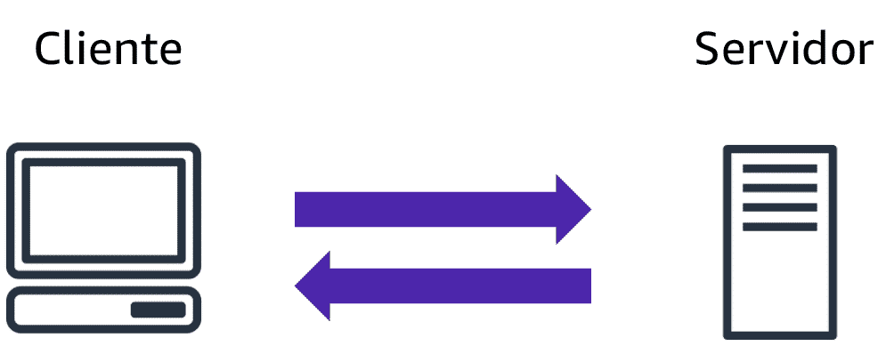

# O que é um modelo cliente-servidor?

Na computação, um cliente pode ser um navegador da web ou uma aplicação de desktop com o qual uma pessoa interage para fazer solicitações a servidores de computador. Um servidor pode ser um serviço, como o Amazon Elastic Compute Cloud (Amazon EC2), um tipo de servidor virtual.

Por exemplo, suponha que um cliente faça uma solicitação de uma matéria jornalística, a pontuação em um jogo on-line ou um vídeo engraçado. O servidor avalia os detalhes dessa solicitação e a atende retornando as informações ao cliente.