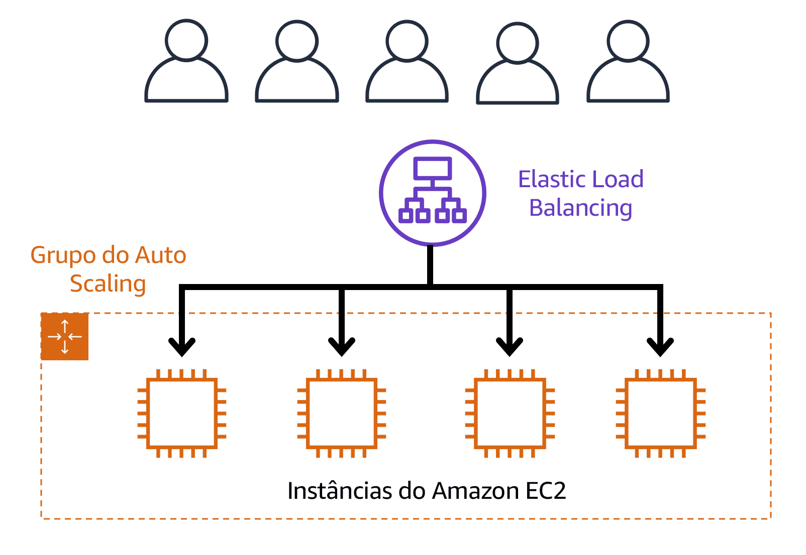

# Elastic Load Balancing

O Elastic Load Balancing é o serviço da AWS que distribui automaticamente o tráfego de entrada de aplicações entre vários recursos, como instâncias do Amazon EC2. 

Um balanceador de carga atua como um ponto único de contato para todo o tráfego na web de entrada para o grupo do Auto Scaling. Isso significa que, à medida que você adiciona ou remove instâncias do Amazon EC2 em resposta à quantidade de tráfego de entrada, essas solicitações são direcionadas para o balanceador de carga primeiro. Em seguida, as solicitações se espalham por vários recursos que lidarão com elas. Por exemplo, se você tiver várias instâncias do Amazon EC2, o Elastic Load Balancing distribuirá a carga de trabalho entre elas para que nenhuma instância tenha que carregar a maior parte. 

Embora o Elastic Load Balancing e o Amazon EC2 Auto Scaling sejam serviços separados, eles trabalham juntos para que as aplicações executadas no Amazon EC2 tenham alto desempenho e disponibilidade. 

# Exemplo: Elastic Load Balancing

**Período de baixa demanda**

Aqui está um exemplo de como o Elastic Load Balancing funciona. Suponha que alguns clientes vieram à cafeteria e estão prontos para fazer seus pedidos. 

Se apenas algumas caixas registradoras estão abertas, isso corresponde à demanda dos clientes que precisam do serviço. A cafeteria tem menos probabilidade de ter caixas registradoras abertas sem clientes. Nesse exemplo, você pode pensar nas caixas registradoras como instâncias do Amazon EC2.

**Período de baixa demanda**

Ao longo do dia, à medida que o número de clientes aumenta, a cafeteria abre mais caixas registradoras para atendê-los. 

Além disso, um funcionário da cafeteria direciona os clientes para a caixa registradora mais adequada para que o número de solicitações possa ser distribuído uniformemente entre as caixas registradoras abertas. Você pode pensar nesse funcionário da cafeteria como um balanceador de carga. 