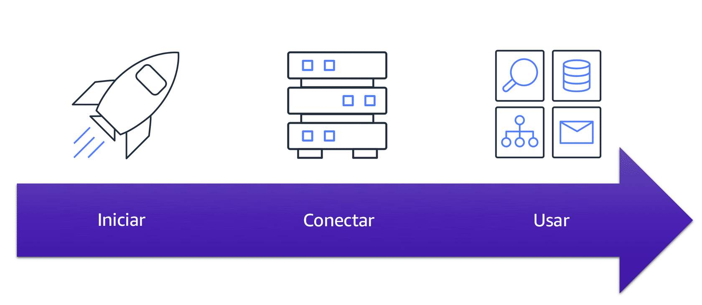

# Amazon Elastic Compute Cloud (Amazon EC2)

[O Amazon Elastic Compute Cloud Amazon EC2](https://aws.amazon.com/pt/ec2/) fornece capacidade computacional segura e redimensionável na nuvem como instâncias do Amazon EC2. 

Imagine que você é responsável pela arquitetura dos recursos de sua empresa e precisa dar suporte a novos sites. Com os recursos on-premises tradicionais, você precisa fazer o seguinte:

- Gastar dinheiro antecipadamente para comprar o hardware.
- Aguardar até que os servidores sejam entregues para você.
- Instalar os servidores em seu data center físico.
- Fazer todas as configurações necessárias.

Em comparação, com uma instância do Amazon EC2, você pode usar um servidor virtual para executar aplicações na nuvem AWS.

- Você pode provisionar e iniciar uma instância do Amazon EC2 em minutos.
- Você pode parar de usar a instância quando terminar de executar uma carga de trabalho.
- Você paga apenas pelo tempo de computação em que uma instância está em execução, não quando ela é interrompida ou terminada.
- Você pode economizar custos pagando apenas pela capacidade do servidor necessária ou desejada.

# Como o Amazon EC2 funciona

- Iniciar
  - Primeiro você inicia uma instância
  - Comece seleecionando um modelo com configurações báiscas para sua instância
  - Essas configurações incluem o sistema operacional, o servidor de aplicativos ou os aplicativos
  - VOcê também precisa selecionar o tipo de instância, que é a configuração de hardware específica da sua instância

> À medida que se prepara para iniciar uma instância, você deve especificar as configurações de segurança para controlar o tráfego de rede enviado ou recebido pela instância. Mais adiante neste curso, exploraremos os recursos de segurança do Amazon EC2 com mais detalhes.

- Conectar 
    - Em seguida, você se conecta à sua instância
    - Você pode se conectar de várias maneiras
    - Seus programas e aplicativos têm vários métodos diferentes para se conectar diretamente à instância e trocar dados.
    - Os usuários também podem se conectar à instância por meio de uma conexão de desktop remoto, como o Remote Desktop Protocol (RDP) para Windows ou o Secure Shell (SSH) para Linux.

- Usar
  - Depois de se conectar à sua instância, você pode usá-la como faria com qualquer servidor local.
  - Voc~e pode executar comandos para instalar software, adicionar armazenamento, copiar e organizar arquivos e muito mais