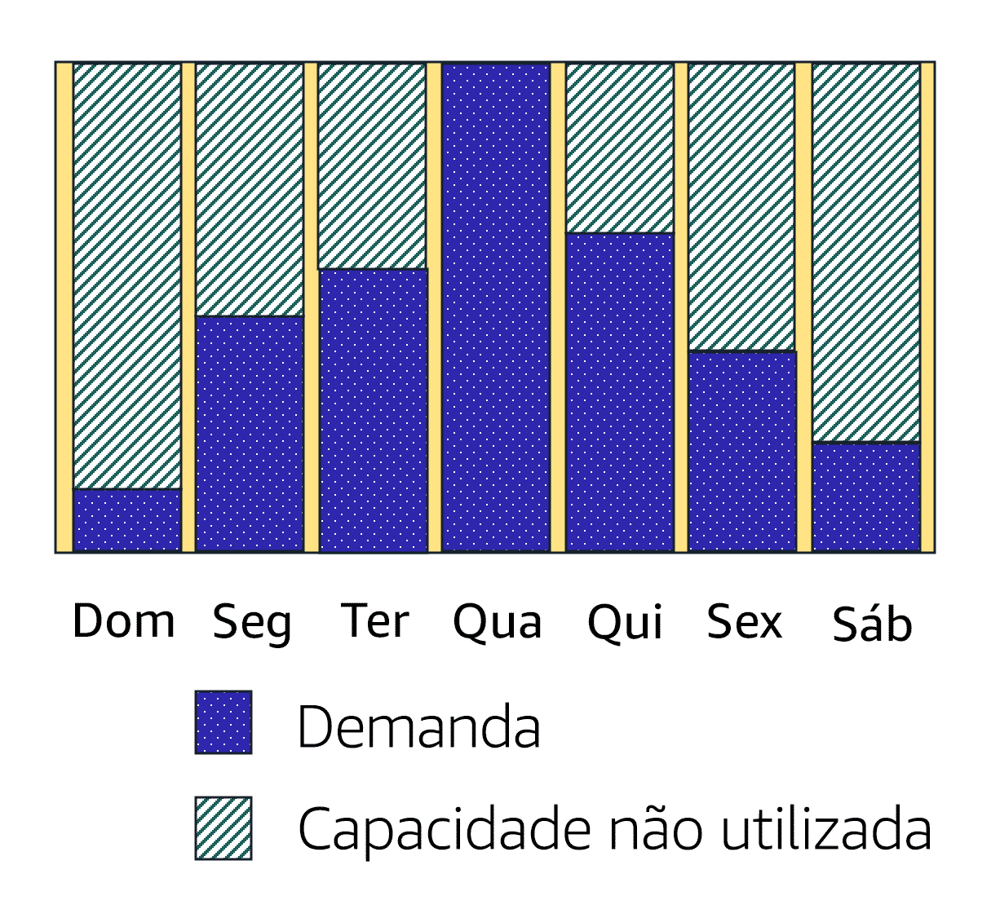
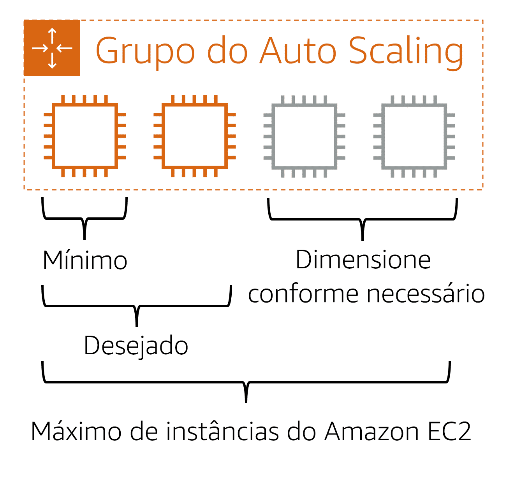

# Dimensionamento e elasticidade  

### Dimensionamento

O dimensionamento significa começar apenas com os recursos necessários e projetar a arquitetura para responder automaticamente às alterações de demanda, fazendo aumentos ou reduções de quantidade. Como resultado, você paga apenas pelos recursos que usa. Você não precisa se preocupar com a falta de capacidade de computação para atender às necessidades dos clientes.

Se você quisesse que o processo de scaling acontecesse automaticamente, qual serviço da AWS você usaria? O serviço da AWS que fornece essa funcionalidade para instâncias do Amazon EC2 é o Amazon EC2 Auto Scaling.

### Amazon EC2 Auto Scaling

Se você já tentou acessar um site que não carregava e atingiu o tempo limite algumas vezes, ele pode ter recebido mais solicitações do que conseguia atender. Essa situação é semelhante a esperar em uma longa fila em uma cafeteria quando há apenas um barista disponível para registrar os pedidos dos clientes.

O Amazon EC2 Auto Scaling permite que você adicione ou remova automaticamente instâncias do Amazon EC2 em resposta à alteração da demanda da aplicação. Ao fazer auto scaling das instâncias, aumentando ou reduzindo a quantidade conforme a necessidade, você tem maior percepção de disponibilidade de aplicações.

No Amazon EC2 Auto Scaling, há duas abordagens disponíveis: scaling dinâmico e scaling preditivo.

- O scaling dinâmico responde às alterações na demanda. 
- O scaling preditivo programa automaticamente o número correto de instâncias do Amazon EC2 com base na demanda prevista.

---

### Aumento de demanda

É possível lidar com o aumento de demanda de duas formas:  você pode aumentar verticalmente ou aumentar a quantidade.  O aumento vertical significa adicionar mais potência às máquinas em funcionamento,  o que pode fazer sentido em alguns casos.

Mas pense numa coisa quando a quantidade de clientes aumenta,  uma estância maior de funcionário não consegue pegar o pedido de um cliente mais rapidamente.  Isso depende mais do cliente do que do funcionário.  Vou querer um espresso...  ah, espera...  Isso é orgânico?

Pode fazer um café com leite de soja?  Na verdade, eu não sei...  Você tem apenas chá?  Precisamos de mais funcionários...  parece que as instâncias de processamento ficarão sobrecarregadas.  Então vamos dimensioná-las também.

A pergunta é óbvia: porque essas instâncias estão aceitando pedidos novos ao invés de fazer os que já existem?  Neste caso a quantidade de trabalho possível é ainda maior do que a capacidade das máquinas de pedido.  Você não tem um backlog, portanto, não há razão para adicionar mais instâncias de operadores.  Essa é uma das grandes vantagens do desacoplamento do sistema.

É possível ter a capacidade certa para cada parte do processo  em vez de provisionamento excessivo para resolver um problema separado, certo?  Parece que essa demanda foi resolvida.  Veja a diferença que a AWS faz na sua empresa.  Se você não precisa de todos os funcionários extra que ficam ociosos,  mande-os para casa ou interrompa as instâncias.

O Amazon EC2 AutoScaling  adiciona instâncias com base na demanda e as descomissiona quando não são mais necessárias.  Isso significa que a quantidade de instâncias é correta a cada minuto do dia.  Clientes felizes, diretor financeiro feliz, arquitetura feliz! 

### Exemplo: Amazon EC2 Auto Scaling

Já que na nuvem a capacidade computacional é um recurso programático, você pode adotar uma abordagem mais flexível para o problema de scaling. Ao adicionar o Amazon EC2 Auto Scaling a uma aplicação, você poderá adicionar novas instâncias à aplicação quando for necessário e terminá-las quando não for mais necessário.

Suponha que você esteja se preparando para iniciar uma aplicação em instâncias do Amazon EC2. Ao configurar o tamanho do seu grupo do Auto Scaling, você pode definir o número mínimo de instâncias do Amazon EC2 como sendo um. Isso significa que, em qualquer momento, precisa haver pelo menos uma instância do Amazon EC2 em execução.

Ao criar um grupo do Auto Scaling, você pode definir o número mínimo de instâncias do Amazon EC2. A capacidade mínima é o número de instâncias do Amazon EC2 que são iniciadas imediatamente após a criação do grupo do Auto Scaling. Neste exemplo, o grupo do Auto Scaling tem uma capacidade mínima de uma instância do Amazon EC2.

Em seguida, você pode definir a capacidade desejada como duas instâncias do Amazon EC2, mesmo que a aplicação precise de um mínimo de uma única instância do Amazon EC2 para que seja executada.

> A terceira configuração que você pode definir em um grupo do Auto Scaling é a capacidade máxima. Por exemplo, você pode configurar o grupo do Auto Scaling para aumentar a quantidade em resposta à demanda elevada, mas apenas para um máximo de quatro instâncias do Amazon EC2.

> Como o Amazon EC2 Auto Scaling usa instâncias do Amazon EC2, você vai pagar apenas pelas instâncias que usar, e somente quando elas forem usadas. Você agora tem uma arquitetura econômica que proporciona a melhor experiência do cliente e ao mesmo tempo reduz custos.