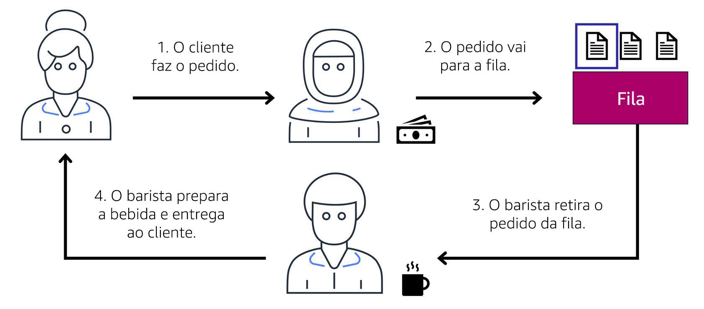

# Sistema de mensagens e enfileiramento

## Aplicações monolíticas e microsserviços

As aplicações são formadas por vários componentes. Os componentes se comunicam entre si para transmitir dados, atender solicitações e manter o aplicativo em execução. 

Suponha que você tenha uma aplicação com componentes com acoplamento forte. Esses componentes podem ser bancos de dados, servidores, interface do usuário, lógica de negócios e assim por diante. Esse tipo de arquitetura pode ser considerado uma aplicação monolítica. 

Nessa abordagem sobre a arquitetura da aplicação, se um único componente falhar, vai ocorrer falha de outros componentes e possivelmente de toda a aplicação.

Para manter a disponibilidade da aplicação quando um único componente falha, você pode projetar essa aplicação com uma abordagem de microsserviços.

Em uma abordagem de microsserviços, os componentes da aplicação têm um acoplamento fraco. Neste caso, se um único componente falhar, os outros componentes continuarão funcionando porque estarão em comunicação uns com os outros. O acoplamento fraco evita a falha completa do aplicativo. 

Ao projetar aplicações na AWS, você pode adotar uma abordagem de microsserviços com serviços e componentes que cumprem funções diferentes. Dois serviços facilitam a integração de aplicativos: Amazon Simple Notification Service (Amazon SNS) e Amazon Simple Queue Service (Amazon SQS).

## Amazon Simple Notification Service (Amazon SNS)

O Amazon Simple Notification Service (Amazon SNS) é um serviço de publicação/assinatura. Usando tópicos do Amazon SNS, um editor publica mensagens para assinantes. Isso é semelhante à cafeteria: o operador de caixa entrega os pedidos ao barista que, por sua vez, prepara as bebidas.

No Amazon SNS, os assinantes podem ser servidores da web, endereços de e-mail, funções do AWS Lambda ou várias outras opções. 

--- 

### Passo 1: Publicação de atualizações de um único tópico

Suponha que a cafeteria tenha uma única newsletter com notícias de todas as áreas do negócio. Ela tem como tópicos cupons, curiosidades sobre café e novos produtos. Todos esses tópicos são agrupados por ser uma única newsletter. Todos os clientes inscritos na newsletter recebem notícias sobre cupons, curiosidades sobre café e novos produtos.

Depois de algum tempo, alguns clientes informam que preferem receber newsletters separadas apenas para os tópicos de interesse deles. Os proprietários da cafeteria decidem tentar essa abordagem.

### Passo 2: Publicação de atualizações vários tópicos

Agora, em vez de ter uma única newsletter para todos os tópicos, a cafeteria dividiu-a em três newsletters separadas. Cada newsletter é dedicada a um tópico: cupons, curiosidades sobre café e novos produtos.

Os assinantes vão receber imediatamente apenas as novidades dos tópicos aos quais se inscreveram.

É possível que os assinantes se inscrevam em um ou mais tópicos. Por exemplo, o primeiro cliente se inscreve apenas no tópico de cupons e o segundo assinante se inscreve apenas no tópico de curiosidades sobre café. O terceiro cliente se inscreve tanto em curiosidades sobre café quanto no tópico de novos produtos.

## Resumo
Embora esses exemplos da cafeteria envolvam assinantes que são pessoas, no Amazon SNS, os assinantes podem ser servidores da web, endereços de e-mail, funções do AWS Lambda ou várias outras opções.

---

# Amazon Simple Queue Service (Amazon SQS)
O **Amazon Simple Queue Service (Amazon SQS)** é um serviço de enfileiramento de mensagens. 

Use o Amazon SQS para enviar, armazenar e receber mensagens entre componentes de software, sem perder mensagens nem precisar que outros serviços estejam disponíveis. No Amazon SQS, uma aplicação envia mensagens para uma fila. Um usuário ou serviço recupera uma mensagem da fila, processa-a e a apaga da fila.

Para ver dois exemplos de como usar o Amazon SQS, escolha os botões de seta para exibir cada um.

### Exemplo 1: atendimento de um pedido

Suponha que a cafeteria tenha um processo de pedido em que um funcionário na caixa registradora recebe os pedidos e um barista prepara as bebidas. Pense nesses dois funcionários como dois componentes separados de um aplicativo. 

Primeiro, o operador de caixa anota o pedido em um pedaço de papel. Em seguida, ele entrega o papel ao barista. Por fim, o barista faz a bebida e a serve ao cliente.

Quando o próximo pedido chegar, o processo se repete. Esse processo funciona sem problemas, desde que o operador de caixa e o barista sejam coordenados.

O que poderia acontecer se o operador de caixa anotasse um pedido e o entregasse ao barista, mas esse último estivesse em uma pausa ou ocupado com outro pedido? O operador de caixa precisaria esperar até que o barista estivesse pronto para aceitar o pedido. Isso causaria atrasos no processo e maior espera dos clientes para receber os pedidos.

Como a cafeteria se tornou mais popular os pedidos estão mais devagar, os proprietários percebem que o processo atual é demorado e ineficiente. Eles decidem tentar uma abordagem diferente que usa uma fila.

### Exemplo 2: pedidos em uma fila

Lembre-se que o operador de caixa e o barista são dois componentes separados de uma aplicação. Um serviço de enfileiramento de mensagens, como o Amazon SQS, permite a troca de mensagens entre complementos de aplicações desacopladas.

Nesse exemplo, a primeira etapa do processo permanece a mesma que antes: um cliente faz um pedido para o operador de caixa. 

O operador de caixa coloca o pedido em uma fila. Você pode pensar nisso como um quadro de pedidos que serve como buffer entre o operador de caixa e o barista. Mesmo que o barista esteja em uma pausa ou ocupado com outro pedido, o outro funcionário pode continuar colocando novos pedidos na fila. 

Em seguida, o barista verifica a fila e seleciona o pedido.

O barista prepara a bebida e a serve ao cliente. 

O barista, em seguida, remove o pedido concluído da fila. 

Enquanto o barista está preparando a bebida, o operador de caixa continua recebendo e adicionando novos pedidos à fila.

### Resumo
Para aplicações e microsserviços desacoplados, o Amazon SQS permite enviar, armazenar e recuperar mensagens entre componentes. 

Essa abordagem desacoplada permite que os componentes separados funcionem de modo mais eficiente e independente. 